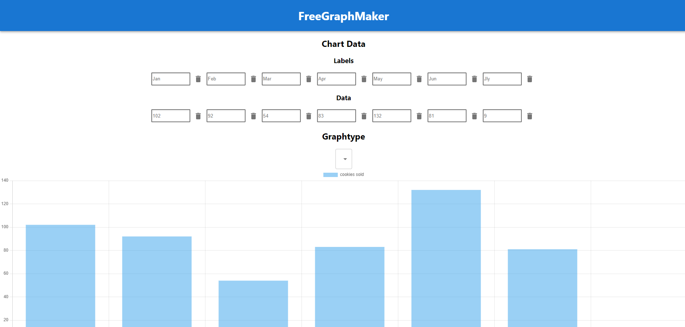

# What is a Free Graph Maker?
Free Graph Maker is an app that allows anyone to create visually appealing graphs and charts instantly.

## Tech
Created with React.js and Chart.js.
Most codes are in -app.js- so feel free to read comments in the file.
* /componets -> A folder that stores components like the DataInput field and Header
* /public -> Folder with images and general files. (**Favicon and Images are lincensed so using any files on public folder for other purposes than using it for this project is illegal. **)

## Author

* Most codes written by me(SnowDingo)
Take a look at my personal blog for more info

## Lincense
This project is a personal project. It doesn't mean that this project has copyright, and illegal copying of the code and the app is not allowed. 
Cloning and improving/fixing issues in this repo is allowed, so feel free to help me with improving this project.
Again most copyright is claimed for ©SnowDingo 2024.
